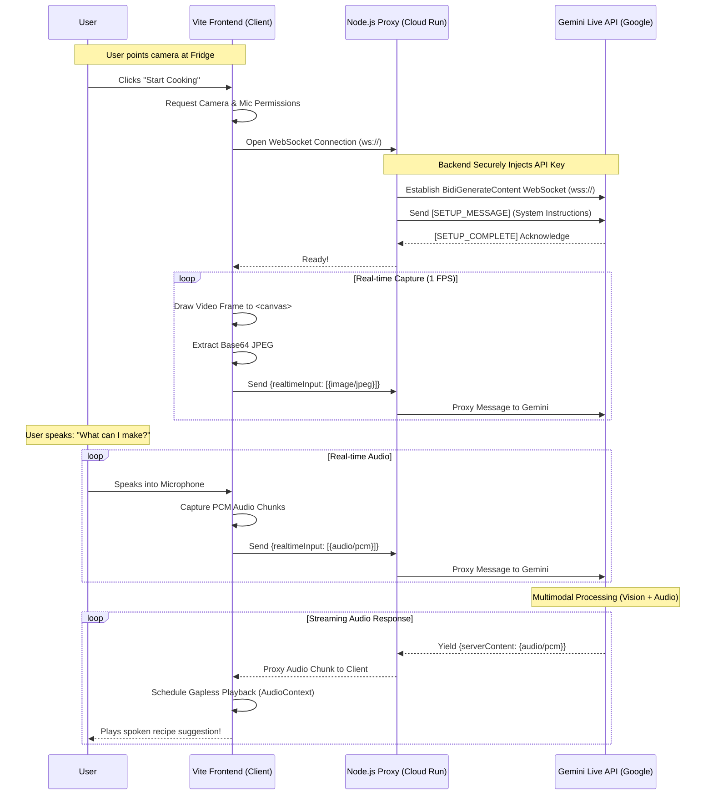

# Fridge-to-Feast 🍳 - Architecture Diagram

This diagram visualizes how the Fridge-to-Feast Live Agent captures multimodal input, proxies it through a secure backend, and streams Audio responses back to the user in real-time.

## System Components List

1. **Vite Frontend (`index.html`, `main.js`, `style.css`)**
   - **Role:** The "Eyes and Ears". 
   - Uses `MediaDevices.getUserMedia()` to access the camera and microphone.
   - Extracts frames to Base64 using a hidden HTML5 `<canvas>`.
   - Renders the aesthetic Glassmorphism UI.

2. **Express/WebSocket Proxy (`server.js`)**
   - **Role:** The secure bridge.
   - Runs on Google Cloud Run. 
   - Protects the `GEMINI_API_KEY` from being exposed in frontend browser source code.
   - Forwards raw WebSocket JSON payloads back and forth instantly to minimize latency.

3. **Gemini Live API (`BidiGenerateContent` endpoint)**
   - **Role:** The Brain.
   - Multimodal model (`gemini-2.0-flash-exp`) evaluates the incoming audio query against the continual stream of jpeg camera frames to generate a cooking recipe.
   - Streams pure PCM audio bytes back for immediate playback without waiting for full text generation.
