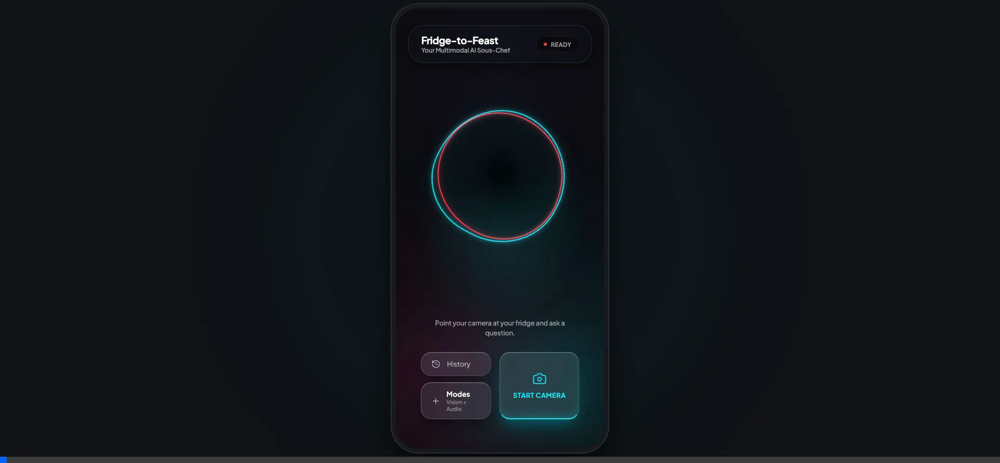
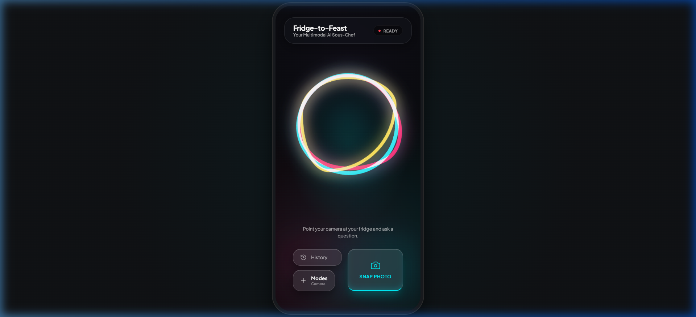
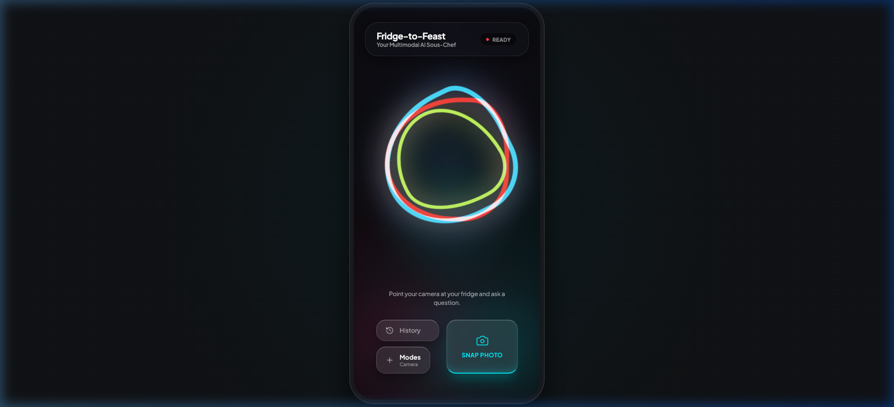
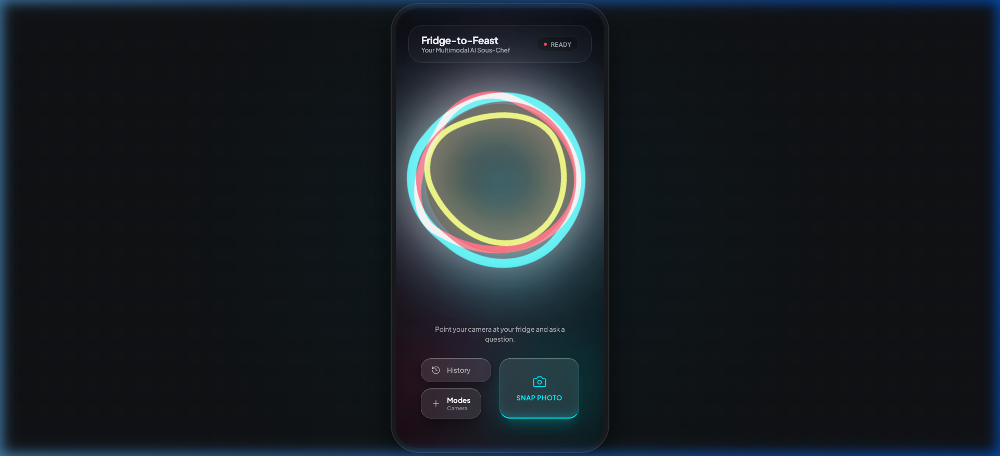
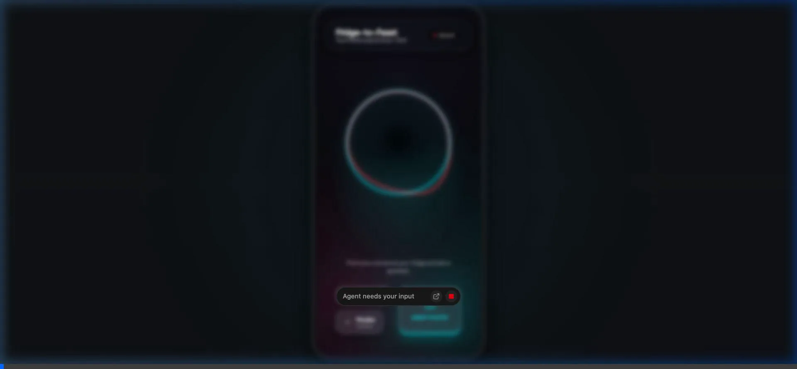

# Fridge-to-Feast 🍳 - AI Sous-Chef

A multimodal AI Live Agent built for the Devpost **Gemini Live Agent Challenge** (Category: Live Agents 🗣️).

## 🚀 The Pitch
Stop typing recipes into a text box! **Fridge-to-Feast** is a real-time, interruptible, conversational AI Sous-Chef. You point your phone camera at your open fridge or pantry, and simply ask: *"I have 15 minutes, what can we make?"* 

The agent "sees" your ingredients and guides you through a recipe verbally. You can interrupt it mid-sentence to ask for substitutions or clarify a step, just like a real chef standing next to you.

## 🛠️ Technologies Used
Designed explicitly for speed, low latency voice interactions, and Google Cloud optimization:

*   **Frontend (The "Eyes & Ears"):** Vanilla HTML/JS/CSS bundled with Vite. A lightweight, framework-free Progressive Web App (PWA) capturing local camera frames via `getUserMedia` and raw PCM audio via `AudioContext` for instant playback.
*   **Backend (The Proxy):** Node.js and Express utilizing `ws` (WebSockets) to securely proxy bidirectional, real-time byte streams (video/audio) and hide the API key.
*   **AI Engine:** Google `gemini-2.0-flash-exp` accessed via the **Gemini Multimodal Live API** websocket, specifically tuned for interruptible, real-time conversation.
*   **Infrastructure:** Google Cloud Run. We automated the containerization and serverless deployment using a custom infrastructure-as-code shell script.

## 🗣️ "Hey Chef" - Wake Word Activation

Just like Siri or Alexa, simply say **"Hey Chef"** to activate the AI. No buttons needed!

| Feature | Description |
| :--- | :--- |
| **Wake Word** | Say "Hey Chef" to start a conversation |
| **Always Listening** | Uses Web Speech API (free, browser-native) |
| **Auto Disconnect** | 30 seconds of silence returns to listening mode |
| **Goodbye Detection** | Say "bye" or "thanks chef" to end the session |

The orb responds visually: it pulses when it hears you speaking, then fully activates when "Hey Chef" is detected.

---

## 🧪 Try It Now (Demo Mode)

**No API key needed!** The app includes a demo mode to showcase the full UI flow:

1. **Switch to Text Mode**: Click `Modes` → `Text Input`
2. **Type Ingredients**: Enter something like `eggs, bread, butter, cheese`
3. **Press Enter**: Watch the AI respond and navigate to recipe suggestions
4. **Explore Recipes**: Tap any recipe card to see full details
5. **Start Cooking**: Click "COOK MODE" for step-by-step guidance

### QR Code for Mobile
On desktop, a QR code appears on the right side. Scan it with your phone to test on mobile instantly!

---

## 📱 Screen Navigation Flow

The app features a seamless multi-screen experience with smooth transitions:

```
┌─────────────────────────────────────────────────────────────────────────┐
│                              HOME SCREEN                                 │
│                     (Voice Orb + Mode Selection)                         │
└─────────────────────────────────────────────────────────────────────────┘
                    │                    │                    │
           📷 Camera Mode         🎤 Audio Mode         ⌨️ Text Mode
                    │                    │                    │
                    ▼                    │                    │
┌─────────────────────────┐              │                    │
│      SCAN SCREEN        │              │                    │
│   (Live Camera Feed)    │              │                    │
│   Detects ingredients   │              │                    │
└─────────────────────────┘              │                    │
           │                             │                    │
           │  "GET RECIPES"              │                    │
           ▼                             ▼                    ▼
┌─────────────────────────────────────────────────────────────────────────┐
│                         SUGGESTIONS SCREEN                               │
│              (Recipe Cards Grid - Based on Ingredients)                  │
│                                                                          │
│   ┌─────────┐  ┌─────────┐  ┌─────────┐  ┌─────────┐                   │
│   │ Recipe1 │  │ Recipe2 │  │ Recipe3 │  │ Recipe4 │                   │
│   │  95%    │  │  90%    │  │  85%    │  │  80%    │                   │
│   └─────────┘  └─────────┘  └─────────┘  └─────────┘                   │
│                                                                          │
│   Voice: "Say a recipe name to select, or tap a card"                   │
└─────────────────────────────────────────────────────────────────────────┘
                              │
                    Tap card or say name
                              ▼
┌─────────────────────────────────────────────────────────────────────────┐
│                          RECIPE SCREEN                                   │
│                   (Full Recipe with Ingredients)                         │
│                                                                          │
│   📷 Recipe Image                                                       │
│   ⏱️ 15 min  |  🔥 Easy                                                 │
│   📋 Ingredients List                                                   │
│   📝 Step-by-Step Directions                                            │
│                                                                          │
│   [ ❤️ Save ]  [ 👨‍🍳 COOK MODE ]                                        │
└─────────────────────────────────────────────────────────────────────────┘
                              │
                       "COOK MODE"
                              ▼
┌─────────────────────────────────────────────────────────────────────────┐
│                          COOK SCREEN                                     │
│                  (Hands-Free Step Navigation)                            │
│                                                                          │
│   ═══════════════════════════════  Progress Bar                         │
│                                                                          │
│   ┌─────────────────────────────────────────────┐                       │
│   │             STEP 2 of 4                     │                       │
│   │                                             │                       │
│   │  "Add minced garlic & sauté until golden"  │  ← Large, readable    │
│   │                                             │                       │
│   └─────────────────────────────────────────────┘                       │
│                                                                          │
│   Next: Pour in the beaten eggs...                                      │
│                                                                          │
│   [ ← Back ]              [ Next → ]                                    │
│                                                                          │
│   Voice: "Say 'next' or 'previous' to navigate"                         │
└─────────────────────────────────────────────────────────────────────────┘
```

### Navigation Features
- **Back Buttons**: Every screen has a back button with smooth slide animation
- **Voice Navigation**: Say recipe names or step commands during cooking
- **Progress Tracking**: Visual progress bar in cook mode
- **Step Checklist**: See all steps at a glance with completion status

---

## 🎭 The Multimodal Experience

**Fridge-to-Feast** offers three distinct ways to interact with your AI Chef. Switch modes on-the-fly using the **Modes** button:

| Mode | Input Method | Best For... |
| :--- | :--- | :--- |
| **📷 Camera** | Live Video + Voice | Quickly identifying everything in your fridge at once. |
| **🎤 Audio** | Voice Only | Hands-free cooking once you've started the recipe. |
| **⌨️ Text Input** | Keyboard | Precise adjustments or searching for specific recipes. |



---

## 🎤 Real-Time Audio System

The audio pipeline is built for **low-latency, interruptible conversation**:

| Component | Technology | Description |
| :--- | :--- | :--- |
| **Mic Capture** | AudioWorklet | Captures PCM audio at 16kHz, streams in real-time |
| **Audio Playback** | AudioContext | Plays Chef's responses at 24kHz with queue management |
| **Interruption** | Voice Activity Detection | Cut off Chef mid-sentence by speaking |

### Interruption Flow
```
You: "What can I make with—"
Chef: "Based on what I see, you could make a delicious—"
You: "Wait, I forgot I have cheese too!"
Chef: [stops immediately] "Oh perfect! With cheese we can make..."
```

---

## ✨ Intelligence In Motion: The AI Voice Orb

We've designed a custom, high-fidelity **AI Voice Orb** that provides instant visual feedback on the Agent's internal state. It uses complex CSS keyframes and radial gradients to feel like a living entity.

### Orb States

| State | Visual Animation | Meaning |
| :--- | :--- | :--- |
| **Idle** | Thin, subtle rings | The Agent is waiting for your input. |
| **Listening** | Thick rings + Gentle Pulse | The Agent is actively hearing your voice. |
| **Thinking** | 360° Rotate + Hue Shift | The Agent is communicating with Gemini and processing your request. |
| **Speaking** | Expansion + Radiant Glow | The Agent is responding to you verbally. |

### Visual Gallery

<table style="width: 100%; text-align: center;">
  <tr>
    <td style="width: 33%;"><strong>Listening</strong></td>
    <td style="width: 33%;"><strong>Thinking</strong></td>
    <td style="width: 33%;"><strong>Speaking</strong></td>
  </tr>
  <tr>
    <td></td>
    <td></td>
    <td></td>
  </tr>
</table>



## 💻 Spin-Up Instructions (Locally Reproducible)

### 1. Prerequisites
- Node.js (v18+)
- A Gemini API Key from [Google AI Studio](https://aistudio.google.com/)

### 2. Backend Setup
1. Clone this repository and navigate to the root directory.
2. Install standard dependencies:
   ```bash
   npm install
   ```
3. Copy the environment variables template and add your API key:
   ```bash
   cp .env.example .env
   ```
   *(Edit `.env` and set `GEMINI_API_KEY=your_actual_key`)*
4. Start the Node.js WebSocket proxy server:
   ```bash
   node server.js
   ```
   *The backend will run on `ws://localhost:3000`.*

### 3. Frontend Setup
1. Open a new terminal instance and navigate to the `frontend` folder:
   ```bash
   cd frontend
   npm install
   ```
2. Start the Vite development server:
   ```bash
   npm run dev
   ```
3. Open your browser to `http://localhost:5173`
4. **Demo Mode**: Try Text mode to test the full flow without an API key
5. **Mobile Testing**: Use the QR code on desktop, or run `npm run dev:network` and scan the QR code with your phone

## ☁️ Google Cloud Deployment (Bonus Criteria)
We have fully automated our Google Cloud Run deployment using Infrastructure-as-Code principles.

To easily replicate our exact Cloud Run environment, run the provided deployment script:
```bash
chmod +x deploy.sh
./deploy.sh
```
This script automatically packages the application and deploys it as an unauthenticated service on Google Cloud Run using Google Cloud Buildpacks, while securely injecting the `GEMINI_API_KEY`.

---

## ✅ Feature Checklist

| Category | Feature | Status |
| :--- | :--- | :---: |
| **Input Modes** | Camera (Vision + Voice) | ✅ |
| | Audio (Voice Only) | ✅ |
| | Text Input | ✅ |
| **Voice** | "Hey Chef" Wake Word | ✅ |
| | Real-time Speech Recognition | ✅ |
| | Interruption Detection | ✅ |
| **Screens** | Home (Voice Orb) | ✅ |
| | Scan (Camera Feed) | ✅ |
| | Recipe Suggestions (Card Grid) | ✅ |
| | Recipe Details | ✅ |
| | Cook Mode (Step-by-Step) | ✅ |
| **UX** | Glassmorphism UI | ✅ |
| | Smooth Screen Transitions | ✅ |
| | Progress Tracking | ✅ |
| | QR Code for Mobile | ✅ |
| **Demo** | Works Without API Key | ✅ |
